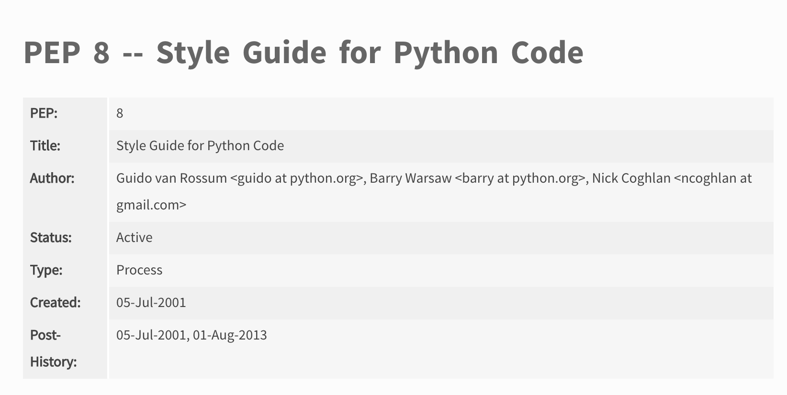

# Quality data science deliverables

Soon you will be given your **first project assignment**. Many questions will be answered then. 

But it is safe to assume that a **presentation** and a **jupyter notebook** will be involved.
I'm sure we've all seen.... *questionable* presentations.


## Learning goals:

- Assess a few presentation decks and generate a list of best practices
- Practice formating text in markdown
- Identify the differences between jupyter notebooks in different stages of analysis
- Identify your growth area in presentations and generate a list of steps


## Goal 1: Presentations and decks

[Article 1](https://24slides.com/presentbetter/seven-worst-presentations-time-went-wrong/), [Article 2](https://blog.lemonadestand.org/bad-powerpoint-presentations/), [Article 3](https://elearningindustry.com/creating-powerpoint-presentations-5-mistakes-avoid), [Article 4](https://www.makeuseof.com/tag/powerpoint-presentation-mistakes/)

### Best practices review!!!!

###  Task: fill doc
[group article review doc](https://docs.google.com/document/d/1vRiUjoJ7Rd4sWTqOEetxqMNuYa7gJiSyF31tXBuxSWw/edit?usp=sharing)

### Content vs Style vs Format

**Content**:
- Does your deck tell a story
- Is your story in three parts?
- What is your text?
- What are your titles?

**Style**:



**Format**:
- Grammar
- Whitespace
- Transitions

### Task:

Review these two decks: [V2](https://docs.google.com/presentation/d/1i2_9VSOeX78UK6EGrUNnI9j4b7PPt_hia_8z1DWYju0/edit?usp=sharing) and [V1](https://docs.google.com/presentation/d/1Vvnya28jwm7EBWDImB-easLgUZuW3Uj_gJSpTeITYnw/edit?usp=sharing)
- Which is "better"?
- What could be improved in each?

## Goal 2: Practice formatting text in markdown

***

Which of these two is easier to read?

[Doc 1](https://github.com/flatiron-school/ds_project_best_practices/tree/ds_lesson_starters/markdown-test/no-markdown) vs [Doc 2](https://github.com/flatiron-school/ds_project_best_practices/tree/ds_lesson_starters/markdown-test#predicting-tomorrows-rainfall-in-australia)


### Task: update Doc 1 to match the style of Doc 2

[markdown cheat sheet](https://guides.github.com/pdfs/markdown-cheatsheet-online.pdf)


```python

```

## Goal 3: Identify the differences between jupyter notebooks in different stages of analysis

When you write a paper or a report, what version do you share with your boss or your audience? Does it look different than when you started?

### Task: order notebooks

- We have three notebooks and note their differences and similarities
    + [V1_Australia_rain.ipynb](https://nbviewer.jupyter.org/github/flatiron-school/ds_project_best_practices/blob/ds_lesson_starters/V1_Australia_rain.ipynb)
    + [V2_Australia_rain.ipynb](https://nbviewer.jupyter.org/github/flatiron-school/ds_project_best_practices/blob/ds_lesson_starters/V2_Australia_rain.ipynb)
    + [V3_Australia_rain.ipynb](https://github.com/flatiron-school/ds_project_best_practices/blob/ds_lesson_starters/V3_Australian_rain.ipynb)
    
    
- Please review them and order them from lowest to highest 1 being just for your eyes and 3 being for an audience


## Integration:
Will happen and be demonstrated during your presentations and over the next few weeks. This is a growth curve for most. We want you to have a *quality* presentation.


## Reflection:

- What are two new concepts learned during this instruction?
- What's the one area you see in yourself that will need the most focus, where you will be experiencing the most growth?

